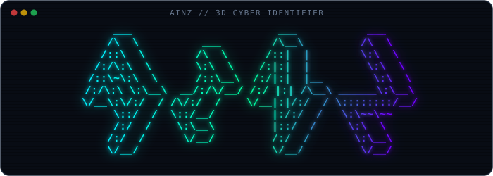

<div align="center">

# MOHAMMED HABIBUR RAHMAN (Ainz)

<p align="center">
  <a href="https://github.com/AinzAmour/readme-typing-svg">
    
  </a>
</p>

<p align="center">
  
</p>

<!-- BADGES ROW -->
<p align="center">
  <a href="https://ainz.space"></a>
  <a href="https://ainz.space/projects.html"></a>
  <a href="https://www.linkedin.com/in/mhr-ainz"></a>
  <a href="mailto:ainz.mhr@gmail.com"></a>
  
</p>

<p align="center">
  
</p>

---

</div>

```console
root@ainz:~# whoami --verbose
[+] Identity    : Mohammed Habibur Rahman (Ainz)
[+] Role        : Cybersecurity Analyst | VAPT | Application Security | Linux Infrastructure
[+] Mission     : Bridging offensive vulnerability research with defensive infrastructure hardening.
[+] Recognition : Zerodha CISO Certificate of Appreciation | 1st Place ARCANE 2K25 CTF
[+] Status      : Available for Cybersecurity, Systems & Full-Stack Opportunities | Ready for Work
```

---

## 🏆 Key Achievements & Recognition

<table align="center" width="100%">
  <tr>
    <td width="50%" valign="top">
      <h3>📜 Vulnerability Research</h3>
      <ul>
        <li><b>Zerodha Bug Bounty Certificate of Appreciation</b> — Signed by CISO (Mar 2026)</li>
        <li>Discovered insufficient <code>postMessage</code> origin validation in web authentication callback flow.</li>
        <li>Engineered full PoC demonstrating cross-origin message interception & remediation controls.</li>
      </ul>
    </td>
    <td width="50%" valign="top">
      <h3>🥇 CTF Wall of Fame</h3>
      <ul>
        <li>🥇 <b>1st Place (Winner)</b> — ARCANE 2K25 National CTF</li>
        <li>🥈 <b>2nd Place</b> — TECHASTRA '25 National CTF</li>
        <li>🥉 <b>3rd Place</b> — ZERODAY CTF 2025 Global CTF (Z3R0_L0G0N)</li>
        <li>🥉 <b>3rd Place</b> — Hackers Asylum CTF (SSN College of Engineering)</li>
        <li>🏅 <b>Top 25 Finalist</b> — H7CTF International CTF (SRM University)</li>
      </ul>
    </td>
  </tr>
</table>

---

## 🚀 Flagship Engineering & Security Projects

<table width="100%">
  <tr>
    <td width="50%" valign="top">
      <h3 align="center">🛡️ NEXUS-HOMELAB</h3>
      <p align="center"><b>Hardened Infrastructure & Cyber Threat Sandbox</b></p>
      <p align="center">
        <a href="https://github.com/AinzAmour/NEXUS-HOMELAB/actions"></a>
      </p>
      <ul>
        <li><b>Architecture:</b> Linux host with 5 segregated Docker networks for ingress, telemetry, AI inference, storage, and sandbox.</li>
        <li><b>Security Baseline:</b> Kernel <code>sysctl</code> hardening (SYN flood & ICMP protection), Fail2ban active ban policy, ED25519 key-only SSH.</li>
        <li><b>Cyber Sandbox:</b> Air-gapped DVWA & OWASP Juice Shop environment for controlled exploit assessment.</li>
        <li><b>Observability & Backups:</b> Prometheus + Grafana telemetry, Uptime Kuma monitoring, local Ollama AI, automated Restic 3-2-1 backups.</li>
      </ul>
      <p align="center">
        <a href="https://github.com/AinzAmour/NEXUS-HOMELAB"><b>[View Repository ↗]</b></a> &nbsp;|&nbsp;
        <a href="https://ainz.space/projects.html#nexus-homelab"><b>[Architecture Deep-Dive ↗]</b></a>
      </p>
    </td>
    <td width="50%" valign="top">
      <h3 align="center">🏢 NEXUS-VMS</h3>
      <p align="center"><b>Enterprise Workplace Access Management System</b></p>
      <p align="center">
        <a href="https://github.com/AinzAmour/NEXUS-VMS/actions"></a>
      </p>
      <ul>
        <li><b>Full-Stack MERN:</b> React 18, Vite, Node.js, Express, MongoDB Atlas, and Tailwind CSS.</li>
        <li><b>Multi-Role RBAC:</b> Role-based access control across Admin, Receptionist, and Host Employee portals.</li>
        <li><b>AppSec Engineering:</b> Stateless HMAC-SHA256 JWT, Helmet HTTP security headers, bcrypt salting, and rate-limiting.</li>
        <li><b>Production UI:</b> Keyboard Command Palette (Cmd+K), real-time visitor queues, and printable security pass badge generation.</li>
      </ul>
      <p align="center">
        <a href="https://nexus-vpms.vercel.app"><b>[Launch Live Web App ↗]</b></a> &nbsp;|&nbsp;
        <a href="https://github.com/AinzAmour/NEXUS-VMS"><b>[View Source ↗]</b></a> &nbsp;|&nbsp;
        <a href="https://ainz.space/projects.html#nexus-vms"><b>[Security Deep-Dive ↗]</b></a>
      </p>
    </td>
  </tr>
</table>

---

## 🛠️ Technical Arsenal & Security Stack

<div align="center">

### Application Security & VAPT
<p>
  
  
  
  
  
  
  
</p>

### Infrastructure & Hardening
<p>
  
  
  
  
  
  
</p>

### SOC & Observability
<p>
  
  
  
  
  
</p>

### Full-Stack & Automation
<p>
  
  
  
  
  
  
</p>

</div>

---

## 📊 GitHub Activity

<div align="center">
  
</div>

<br/>

<!-- CONTRIBUTION SNAKE ANIMATION -->
<div align="center">
  <h3>🐍 GitHub Contribution Grid Snake</h3>
  <picture>
    <source media="(prefers-color-scheme: dark)" srcset="https://raw.githubusercontent.com/AinzAmour/AinzAmour/output/github-contribution-grid-snake-dark.svg">
    <source media="(prefers-color-scheme: light)" srcset="https://raw.githubusercontent.com/AinzAmour/AinzAmour/output/github-contribution-grid-snake.svg">
    
  </picture>
</div>

---

<div align="center">

### 📬 Connect With Me

<p>
  <a href="https://linkedin.com/in/mhr-ainz"></a>
  <a href="mailto:ainz.mhr@gmail.com"></a>
  <a href="https://ainz.space"></a>
  <a href="https://ainz.space/projects.html"></a>
</p>

<sub><i>"System Status: Hardened | Ingress Restricted | Telemetry Active"</i></sub>

</div>
